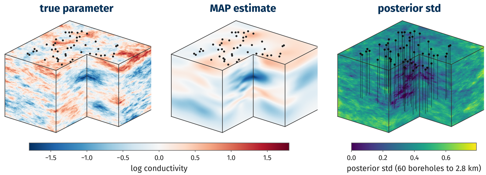
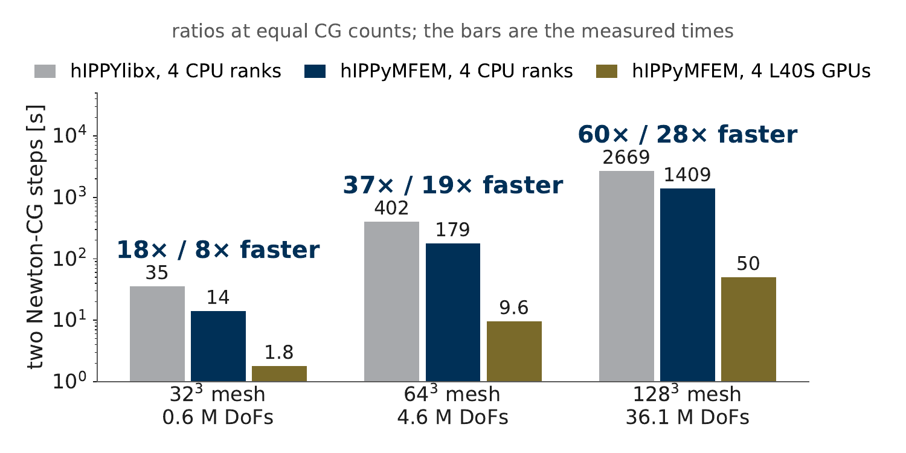
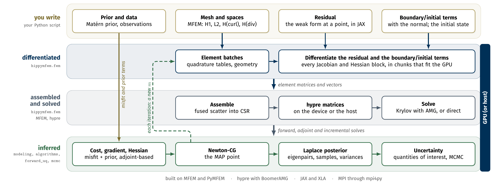

<p align="center">
  
</p>

<h1 align="center">hIPPyMFEM</h1>
<p align="center"><b>Differentiable programming for infinite-dimensional Bayesian inverse problems, using MFEM on GPUs</b><br>
Write the PDE once, as a residual at one quadrature point.<br>
Gradients, Hessians, the MAP point and the posterior follow by automatic differentiation.</p>

<p align="center">
  <a href="https://github.com/hIPPyMFEM/hippymfem/actions/workflows/ci.yml"></a>
  <a href="https://hippymfem.readthedocs.io"></a>
  <a href="LICENSE"></a>
  
  
</p>

*Above: a geothermal inversion at 128³ (36 million unknowns) run end to end on four GPUs: the true
log conductivity, the MAP estimate from temperatures logged in 60 boreholes, and the posterior
standard deviation, lowest where the boreholes reach.*

---

hIPPyMFEM is a library for deterministic and Bayesian inverse problems governed by PDEs,
built on [MFEM](https://mfem.org), [hypre](https://github.com/hypre-space/hypre) and
[JAX](https://github.com/jax-ml/jax). The forward PDE is a JAX function of the fields at one
quadrature point; JAX differentiates it into the residual, the Jacobian, the adjoint, the
parameter derivative and every Hessian block, and the library assembles them straight into
hypre's parallel matrices. On top sits the full workflow of a PDE-constrained Bayesian inverse
problem: inexact Newton-CG and L-BFGS for the MAP point, a low-rank Laplace approximation of
the posterior, Matérn-class priors, MCMC, and forward uncertainty propagation, in parallel with
MPI and on NVIDIA or AMD GPUs.

Because the operators come from differentiating a program rather than a form language, a
constitutive law may be anything JAX can differentiate, a neural-network closure, an inner
Newton solve, a table lookup, and its derivatives stay exact.

## Highlights

| | |
|---|---|
| **One function, every derivative** | The residual, Jacobian, adjoint and every Hessian block come from one JAX function by automatic differentiation; no derivative is coded by hand. The blocks agree with MFEM's own integrators to 10⁻¹⁵. |
| **54 times faster than hIPPYlibx** | Two Newton-CG steps at 36 million unknowns take 50 s on four L40S GPUs, against 2669 s for [hIPPYlibx](https://github.com/hIPPyMFEM/hippylibx) on four CPU cores of the same node (60 times at equal CG counts) and 1409 s for hIPPyMFEM itself on those cores. |
| **A billion unknowns** | One Newton-CG step at 1.09 billion unknowns (400³ P2 hexahedra) takes 197 s on 24 RTX PRO 6000 Blackwell GPUs, JAX compilation included. |
| **The whole Bayesian workflow on GPUs** | MAP point, low-rank Laplace posterior, samples and pointwise variance for a 36-million-unknown problem in 19 minutes on four GPUs. |
| **Cross-validated against hIPPYlibx** | On a shared discrete problem the misfit Hessian's spectrum agrees with hIPPYlibx's to 3.7 × 10⁻¹³ and the MAP cost to 1.3 × 10⁻¹⁴. |
| **NVIDIA and AMD** | The same scripts run on either: the 64³ benchmark takes 18.7 s on one AMD MI210 and 18.5 s on one NVIDIA H100, with the same cost and CG counts. |

## How it compares

<p align="center"></p>

*Two Newton-CG steps of a P2 hexahedral benchmark on one node (four L40S GPUs, two AMD EPYC 9334
CPUs), with the same PDE, prior and BoomerAMG settings in both libraries
([hIPPYlibx](https://github.com/hIPPyMFEM/hippylibx) is hIPPYlib on FEniCSx). The bars are measured
wall times; the ratios charge each CPU run the GPU run's CG count, since the two libraries
stop CG at different iterations.*

## How it scales

| mesh | unknowns | GPUs | two Newton-CG steps |
|---|---|---|---|
| 64³ | 4.57 M | 1 L40S | 27.9 s |
| 128³ | 36.1 M | 4 L40S | 49.5 s |
| 128³ | 36.1 M | 4 AMD Instinct MI210 | 31.9 s |
| 256³ | 287 M | 8 RTX PRO 6000 Blackwell | 140 s |
| 256³ | 287 M | 16 RTX PRO 6000 Blackwell | 77 s |
| 400³ | 1.09 B | 24 RTX PRO 6000 Blackwell | 197 s for one step, compilation included |

The Blackwell GPUs were split into two 48 GB MIG slices each, one MPI rank per slice. The
MI210 row runs the same code with MFEM and hypre built for ROCm, on the same flags and the
same CG count as the L40S row above it. Doubling the Blackwell cards at 256³ is 1.81×, 90 %
of linear.
[`docs/source/guide/gpu.rst`](docs/source/guide/gpu.rst) has the per-stage times, the memory
per rank, and what they depend on.

## How it works

<p align="center"></p>

You write the top row: the prior and the data, the mesh and the spaces, the residual as a
weak form at one quadrature point, and the boundary and initial terms. Everything
below it is generated or reused. No adjoint, Jacobian or Hessian block is written by hand,
and the same script runs on host cores or on GPUs.

## What is inside

- **The inverse-problem layer**: `PDEVariationalProblem` (steady and nonlinear),
  `TimeDependentPDEVariationalProblem`, `Model`, `ReducedHessian` and `modelVerify`. The
  interface keeps the conventions of [hIPPYlib](https://hippylib.github.io), so scripts
  written for it port with few changes
  ([correspondence table](https://hippymfem.readthedocs.io/en/latest/correspondence.html)).
- **Residuals as programs**: domain, boundary (`ds`) and interior-facet (`dS`) densities, so
  Robin conditions, Nitsche terms and discontinuous Galerkin forms are written the same way;
  H1, L2, H(curl), H(div) and vector-valued spaces, with blocks across element families
  (mixed Darcy, Biot poroelasticity).
- **Priors and data**: Laplacian, BiLaplacian (anisotropic, Robin) and finite-dimensional
  Gaussian priors; pointwise, continuous and time-dependent misfits; random numbers that are
  the same on any number of ranks.
- **Optimization and the posterior**: inexact Newton-CG with line search or trust region,
  BFGS and L-BFGS, steepest descent; randomized eigensolvers; the low-rank Laplace
  approximation with samples, traces and pointwise variance.
- **Sampling and forward UQ**: pCN, gpCN and MALA with diagnostics; parameter-to-QoI maps,
  Taylor approximations and variance-reduced Monte Carlo.
- **Parallel and GPU**: MPI throughout; element kernels on the GPU through JAX; MFEM and hypre
  on the device through a CUDA or HIP build of PyMFEM; assembly straight into hypre's
  parallel CSR structure, with the sparsity pattern reused across assemblies.

## Installation

hIPPyMFEM needs PyMFEM built with MPI, mpi4py, NumPy, SciPy and JAX. The PyMFEM wheel on
PyPI is serial only, so the parallel build is made from source:

```bash
sudo apt-get install libopenmpi-dev openmpi-bin      # or load your cluster's MPI
python -m pip install "numpy>=2" scipy
python -m pip install --no-binary mpi4py mpi4py
tools/install_pymfem_parallel.sh                     # PyMFEM 4.8 with MPI: 20-60 minutes
python -m pip install -e ".[all]"
```

Or build the container: `docker build -t hippymfem .`. For GPUs, install JAX for your
card (`jax[cuda12]` or `jax[rocm]`) to run the element kernels there; to put MFEM and hypre on
the card as well, build PyMFEM with `tools/build_pymfem_cuda.sh` (NVIDIA) or
`tools/build_pymfem_hip.sh` (AMD). [INSTALL.md](INSTALL.md) has the details.

## Quick start

A coefficient-field inversion, from synthetic data to the MAP point:

```python
import numpy as np
import mfem.par as mfem, jax.numpy as jnp
from mpi4py import MPI
import hippymfem as hm

mfem.Hypre.Init()
mesh = mfem.ParMesh(MPI.COMM_WORLD,
                    mfem.Mesh.MakeCartesian2D(48, 48, mfem.Element.TRIANGLE))
Vu = hm.FunctionSpace.H1(mesh, 2)      # state
Vm = hm.FunctionSpace.H1(mesh, 1)      # parameter

def pde_varf(u, m, p, x):              # weak residual, at one quadrature point
    return jnp.exp(m.val) * hm.inner(u.grad, p.grad)

bc  = hm.DirichletBC(Vu, lambda x: x[1], bdr_attributes=[1, 3])
pde = hm.PDEVariationalProblem([Vu, Vm, Vu], pde_varf, bc, bc.homogeneous(),
                               is_fwd_linear=True)
prior = hm.BiLaplacianPrior(Vm, gamma=0.1, delta=0.5, robin_bc=True)

# synthetic data: observe the state of a known parameter at 50 points
targets = np.random.default_rng(1).uniform(0.1, 0.9, size=(50, 2))
B       = hm.assemblePointwiseObservation(Vu, targets)
mtrue   = Vm.project(lambda x: np.sin(np.pi * x[0]) * np.sin(np.pi * x[1]))
utrue   = pde.generate_state()
pde.solveFwd(utrue, [utrue, mtrue, None])
data    = B.createVecLeft()
B.mult(utrue, data)
noise_std = 0.01 * data.norm("linf")
B.perturb(data, noise_std)

misfit = hm.DiscreteStateObservation(B, data, noise_std ** 2)
model  = hm.Model(pde, prior, misfit)

solver = hm.ReducedSpaceNewtonCG(model, hm.ReducedSpaceNewtonCG_ParameterList())
x = solver.solve([None, prior.mean.copy(), None])          # the MAP point
```

The same script runs unchanged under `mpirun -n 4`, and with `HIPPYMFEM_DEVICE=gpu` set its
element kernels run on a GPU.

## Tutorials and applications

The tutorials are Jupyter notebooks in [`tutorial/`](tutorial/); the documentation shows them
rendered with their outputs. Notebooks 1 to 7 walk through the standard workflow, from a first
PDE to MCMC (they are adapted from hIPPYlib's tutorials). Notebooks 8 to 12 cover what is
specific to this library: residuals as programs, the GPU path, densities on faces, vector and
mixed-family spaces, and forward uncertainty propagation.

| notebook | what it shows |
|---|---|
| [01_MFEM101](tutorial/01_MFEM101.ipynb) | meshes, spaces and boundary conditions; a PDE as a residual density; convergence rates; a nonlinear problem with no Jacobian written |
| [02_PoissonDeterministic](tutorial/02_PoissonDeterministic.ipynb) | coefficient field inversion with an inexact Newton-CG written by hand, then with the library |
| [03_SubsurfaceBayesian](tutorial/03_SubsurfaceBayesian.ipynb) | Bayesian inversion: the MAP point, the low-rank Laplace approximation, variances and samples |
| [04_AdvectionDiffusionBayesian](tutorial/04_AdvectionDiffusionBayesian.ipynb) | a time-dependent problem: an initial condition from spatio-temporal observations |
| [05_HessianSpectrum](tutorial/05_HessianSpectrum.ipynb) | how the Hessian's spectrum depends on the mesh, the noise and the PDE coefficients |
| [06_MCMC](tutorial/06_MCMC.ipynb) | sampling the full posterior with gpCN, and what a chain is worth |
| [07_GaussianPriors](tutorial/07_GaussianPriors.ipynb) | Matérn priors: variance, correlation, anisotropy, and mesh (in)dependence |
| [08_ResidualsAsPrograms](tutorial/08_ResidualsAsPrograms.ipynb) | a conductivity measured at twelve temperatures and read with a Gaussian kernel: a law no form language can write, with every derivative from AD |
| [09_OnTheGPU](tutorial/09_OnTheGPU.ipynb) | the same script on a GPU: what moves, how to check it did, and the three memory settings that decide how the card is shared |
| [10_FacetsAndDG](tutorial/10_FacetsAndDG.ipynb) | densities on faces: upwind flux, interior penalty and weak boundary conditions for a DG plume at high Péclet number |
| [11_VectorAndMixedFields](tutorial/11_VectorAndMixedFields.ipynb) | a vector state (elasticity), the H(curl) and H(div) families, and a mixed Darcy system whose two fields live in different families |
| [12_ForwardUQ](tutorial/12_ForwardUQ.ipynb) | predicting a number instead of a field: adjoint derivatives of a quantity of interest, a Taylor model with closed-form moments, and Monte Carlo with it as a control variate |

[`applications/`](applications/) holds complete drivers for larger problems: subsurface flow,
advection-diffusion, a Robin boundary coefficient, MCMC, forward UQ, discontinuous Galerkin
transport at high Péclet number, and the 3D basin-scale geothermal inversion pictured above,
with a tabulated, temperature-dependent conductivity.

## Cross-validation against hIPPYlibx

[`validation/`](validation/) solves the *same discrete problem* with hIPPyMFEM and with
[hIPPYlibx](https://github.com/hIPPyMFEM/hippylibx): the same mesh arrays, quadrature degree, observation targets, data and
deterministic sketch, so the comparison is not limited by discretization error. On the
subsurface flow benchmark:

| quantity | relative difference |
|---|---|
| cost, regularization, misfit at a fixed `m₀` | 2e-14 |
| gradient norm, `g · m_true` | 2e-14 |
| `m_trueᵀ H m_true`, full and Gauss-Newton | 2e-14 |
| prior cost and trace | 1e-15 |
| **generalized spectrum of the misfit Hessian at a fixed point (40 values)** | **3.7e-13** |
| MAP total cost | 1.3e-14 |
| MAP state field at 441 points | 1.4e-09 |
| MAP parameter field at 441 points | 3.1e-08 |

The discrete operators agree to machine precision. The MAP fields agree less closely because
the two optimizers stop at different iterations inside the same gradient tolerance, where the
cost is flat; that is why the spectrum is also compared at a fixed point.

## Tests

```bash
./run_tests.sh            # every suite on one rank, a few minutes
./run_tests.sh 1 2 4      # and on two and four ranks
python -m pytest          # the same suites through pytest, on one and two ranks
```

Each suite checks one layer against something external rather than against itself:

| suite | what it checks |
|---|---|
| `test_vectors` | vectors, operators, MultiVector, the parallel RNG; **bit-identical random vectors on 1 to 4 ranks** |
| `test_kernels` | every AD-generated block against MFEM's own integrators on tri/quad/tet/hex, P1 and P2, scalar and vector; finite-difference consistency of second and third derivatives |
| `test_solves` | linear and nonlinear forward solves, adjoint and incremental systems, the adjoint gradient against finite differences |
| `test_modeling` | prior sample covariance against `R⁻¹`, observation operators, `modelVerify` slopes, `ReducedHessian` against a finite-difference Hessian |
| `test_optimization` | trust-region CG, randomized eigensolvers against dense `eigh`, **BFGS independently reproducing the Newton-CG minimizer**, the Laplace approximation |
| `test_timedependent` | time-dependent inversion: first-order gradient, an exact Hessian for the quadratic cost |
| `test_uq` | pCN, gpCN and MALA against an **exact Gaussian posterior**, autocorrelation times, QoI derivatives, Taylor moments, variance-reduced Monte Carlo |
| `test_assembly` | the direct-CSR assembly against MFEM's callback route: every block, every geometry, **exactly zero difference** |
| `test_solvers` | exact parallel solves against dense ones, **the same answer on 1, 2 and 4 ranks**, and the PETSc bridge |
| `test_boundary` | boundary (`ds`) integrals against MFEM's boundary integrators, a Robin problem, parameter-dependent boundary blocks |
| `test_facets` | interior-penalty DG against MFEM's `DGDiffusionIntegrator`, faces shared between ranks, a DG inverse problem's gradient and Hessian |
| `test_vectorfe` | H(curl) and H(div) blocks against MFEM, mixed Darcy and Biot poroelasticity blocks, an H(curl) inverse problem |
| `test_nb` | the plotting helpers, exact at every sample point on every rank count |
| `test_gpu`, `test_device` | the GPU path against the CPU path at round-off, and MFEM and hypre on the device with a CUDA or HIP build of PyMFEM |

The random streams do not depend on the number of ranks, so prior samples, synthetic data and
MAP points agree across rank counts to the tolerance of the solves, which is how ghost and
true-dof mistakes get caught.

## Known limits

The full list, with measurements, is in the documentation (`docs/source/limits.rst`). In short:

1. **Interior facet terms need conforming faces**; a mesh with a hanging node is refused
   by the facet kernels with an error, and variable-order spaces are rejected. The
   time-dependent problem class takes a domain density only.
2. **Direct solves are exact on any number of ranks, but replicated.** `hm.LUSolver`
   factorizes the whole matrix on every rank and refuses problems above 400 000 unknowns;
   `hm.PETScLUSolver` factorizes in parallel when petsc4py is available, and
   `hm.KrylovSolver` is the choice for large problems.
3. **A rank holds at most about four million P2 hexahedra**, because hypre addresses its
   nonzeros with a 32-bit int; past that, add ranks. Assemblies that large also want JAX's
   arena preallocated rather than grown ([`docs/source/guide/gpu.rst`](docs/source/guide/gpu.rst)).
4. **GPU execution is opt-in** and pays off above roughly 10⁴ elements per rank. The kernels
   move to the GPU with JAX alone; moving the solves needs a CUDA or HIP build of PyMFEM,
   which the scripts in `tools/` produce.
5. **Randomized eigenvector tails** are round-off limited beyond a spectral ratio of about
   10⁵, and quantities built from them inherit that.
6. **Object lifetime.** PyMFEM hands raw pointers to MFEM, so a garbage-collected wrapper is a
   crash rather than an exception. The library keeps alive what it hands over; code that calls
   MFEM directly has to do the same.

## Documentation

The user guide, the rendered tutorials and the API reference are at
**https://hippymfem.readthedocs.io**; to build them locally,
`pip install ".[docs]" && make -C docs html`.

## Citing

If you use hIPPyMFEM, please cite it ([CITATION.cff](CITATION.cff)). A paper describing the
method and the measurements is in preparation.

## Acknowledgments

The inverse-problem layer is adapted from hIPPYlib (U. Villa, N. Petra and O. Ghattas, ACM
Transactions on Mathematical Software 47(2), 2021), whose interface conventions it keeps, and
tutorials 1 to 7 are adapted from hIPPYlib's. The finite element machinery is MFEM's, the
solvers are hypre's and the automatic differentiation is JAX's. Computations used a four-L40S
node at Georgia Tech and the ICE cluster of Georgia Tech's Partnership for an Advanced
Computing Environment (PACE).

## License

hIPPyMFEM is free software under the GNU General Public License, version 2.0 dated June 1991
(GPL-2.0-only); see [LICENSE](LICENSE). The modules of its inverse-problem layer that derive
from hIPPYlib, and the adapted tutorials, carry hIPPYlib's copyright as listed in
[COPYRIGHT](COPYRIGHT); the finite element, assembly, automatic differentiation, device and
application code is original. MFEM, PyMFEM, hypre, JAX and mpi4py are imported, not contained,
and used under their own licenses. Contributions are welcome: see
[CONTRIBUTING.md](CONTRIBUTING.md), and [CHANGELOG.md](CHANGELOG.md) for what changed between
versions.
