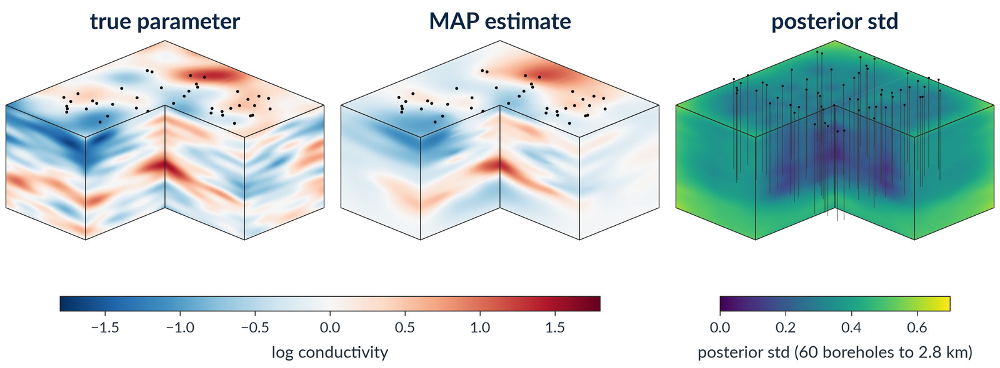

# Basin-scale geothermal heat-flow inversion

Steady heat conduction in an 8 km x 8 km x 4 km block of layered rock, with a
conductivity that depends on temperature through a *tabulated* law per lithology, is
inverted for the rock's reference conductivity from borehole temperature logs.  It is
chosen to exercise what is specific to hIPPyMFEM: a residual density that no form language
expresses (a table read with a Gaussian kernel, a lithology map with dipping interfaces,
an anisotropic tensor), differentiated exactly by JAX at the quadrature points, and the
whole Bayesian workflow (MAP, Laplace approximation, posterior samples, a quantity of
interest) on GPUs.

## The model (`model.py`)

- **PDE.** `-div(k(m, T, x) D grad T) = q(x)` on the unit cube (the block in scaled
  coordinates, `D = diag(1, 1, (L/H)^2)`), `T` in units of 100 K above the surface.
  Dirichlet `T = 0` on the top face, a basal heat flux of 66 mW/m^2 on the bottom face
  (a boundary density), no flux on the sides, radiogenic heat production per lithology.
- **Conductivity.** `k = exp(m) f_lith(x)(T)`, where `f` is the Vosteen & Schellschmidt
  (2003) law `k0 / (0.99 + T (a - b/k0))` for sediments, carbonates and basement,
  *tabulated* at 16 temperatures and read with a Gaussian kernel (smooth in `T`, so the
  Hessian is exact and the Newton solves converge quadratically).  The unknown `m` is
  the log of the reference conductivity relative to 2.5 W/(m K).
- **Data.** 60 vertical boreholes at random positions, one temperature sample per
  element layer from the surface to 2.8 km depth (45 per borehole at 64^3), noise 0.5 K.
- **Prior.** BiLaplacian, `gamma = 0.3`, `delta = 4.8`, `Theta = diag(1, 1, 0.25)`,
  Robin boundary: marginal std 0.50 in log k, correlation length 2 km horizontally and
  0.5 km vertically.
- **Truth.** A prior sample plus a buried high-conductivity body (log k + 1, radius
  1 km, centred at 2.3 km depth).  With a Dirichlet top and a flux bottom the thermal
  signature of a conductive body lives at and below it, so the logs reach its depth.
- **Solvers.** The Jacobian `dR/dT` carries `k'(T) dT grad T . grad p` and is not
  symmetric, so the forward and incremental solves use GMRES with BoomerAMG, and the
  adjoint applies the true transpose with the forward operator's AMG hierarchy
  (`symmetric_jacobian=False, transpose_free_adjoint=True`).

## The workflow (`run.py`)

From the repository's root:

    HIPPYMFEM_DEVICE=gpu HIPPYMFEM_HYPRE_DEVICE=1 PYTHONPATH=<cuda pymfem> \
      mpirun -n 4 tools/mpirun_pinned.sh python -m applications.geothermal.run --n 64 --k 200 \
        --out results/geothermal_n64.json --dump results/geothermal_n64.npz \
        --paraview results/paraview/geothermal_n64
    python -m applications.geothermal.figures results/geothermal_n64.npz \
        --json results/geothermal_n64.json --out results/figures/geothermal_n64

1. synthetic truth and data; the prior's pointwise std by Monte Carlo;
2. the MAP by inexact Newton-CG (five Gauss-Newton iterations, then full Newton,
   backtracking line search);
3. the Laplace approximation: `doublePassG` with `k` eigenpairs and `p` oversampling;
4. posterior samples; the pointwise variance by Monte Carlo (unbiased, unlike the
   randomized estimator); traces; the KL divergence from the prior; the fraction of dofs
   at which the truth lies within two posterior standard deviations of the MAP;
5. the quantity of interest, the mean temperature in the target volume around the
   anomaly, at the MAP with its linearized posterior standard deviation
   (`sqrt(g^T Gamma_post g)`) and over posterior samples pushed through the nonlinear
   forward solve.

Rank 0 writes a JSON record of every timing and number, and with `--dump` the truth,
the MAP, the prior and posterior std on the P1 grid, the eigenvalues, the borehole
coordinates, the data and the sampled QoI values.  `figures.py` turns a dump into the
slice, spectrum, QoI and profile figures.  Without a GPU, drop the two variables and
the launcher wrapper: `--n 16` takes seven minutes on one host core.

## The checks (`validate.py`)

    python -m applications.geothermal.validate fd       --n 16    # FD slopes 1 +- 0.05, Hessian symmetric to 1e-10
    python -m applications.geothermal.validate forward  --n 32    # <= 6 Newton iterations to 1e-9
    python -m applications.geothermal.validate variance --n 16    # MC and sample variance vs the exact posterior variance
    python -m applications.geothermal.validate partition a.npz b.npz c.npz   # dumps at 1, 2, 4 ranks agree

Each check prints its verdict.

## What to expect

On 48 GB cards (NVIDIA L40S):

| mesh | state unknowns | data | GPUs | MAP (Newton, CG iterations) | Laplace (eigenpairs) | QoI: truth, at the MAP, linearized std |
|------|---------------:|-----:|-----:|-----------------------------|----------------------|----------------------------------------|
| 32³  | 274 625        | 1 320 | 1   | 4 min (24, 790)             | 18 s (50)            | 85.09, 85.17, 0.45 K                   |
| 64³  | 2 146 689      | 2 700 | 4   | 8 min (19, 690)             | 2.5 min (200)        | 45.00, 44.92, 0.10 K                   |

The truth is a different prior sample on every mesh, hence the two target temperatures.

- **How many eigenpairs.**  The data inform more directions than the default `--k 50`
  on a fine mesh: at 64³ the 200th eigenvalue is still 2.6, and at 128³ about 900 are
  above one.  Raise `--k` until the eigenvalues pass one when the posterior variance
  itself is the result.
- **Samples against the MAP.**  The QoI over posterior samples lies above its value at
  the MAP, by 1.6 and 3.6 linearized standard deviations at 32³ and 64³ (with a fixed
  basal flux the temperature at depth is convex in the log conductivity).
  `qoi.taylor_qoi` estimates that shift from the second-order term, and the record holds
  it as `qoi_taylor2_hutchinson_mean_K`.
- **Memory.**  `--gauss-newton` drops the second-order blocks of the Hessian; with it
  the MAP and the Laplace approximation at 128³ (17 million state unknowns) fit four
  48 GB cards (`--gauss-newton --skip-qoi`).
