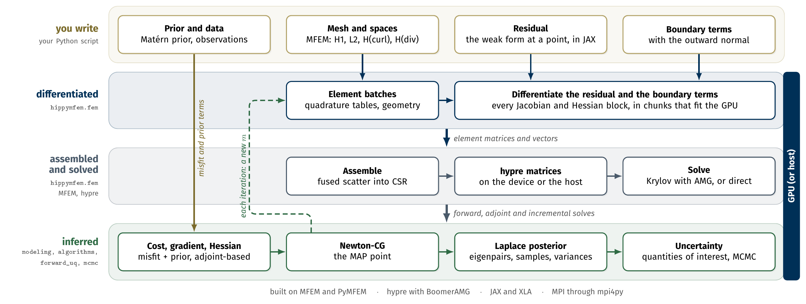

hIPPyMFEM
=========

**Deterministic and Bayesian inverse problems on MFEM, with differentiable
physics.**

hIPPyMFEM is a library for inverse problems governed by PDEs, built on
`MFEM <https://mfem.org>`_, `hypre <https://github.com/hypre-space/hypre>`_ and
`JAX <https://github.com/jax-ml/jax>`_.  You write the weak residual of the forward PDE
once, as a density at a single quadrature point, and the library supplies everything a
PDE-constrained inverse problem needs:

* adjoint-based gradients and matrix-free reduced Hessians, exact for the
  discretized problem rather than approximated;
* inexact Newton-CG (line search and trust region) for the MAP point, and
  limited-memory BFGS as an independent check;
* a low-rank Laplace approximation of the posterior from randomized generalized
  eigensolvers;
* Matern-class (bi-Laplacian) priors with exact sampling;
* dimension-independent MCMC (pCN, gpCN, MALA) and forward uncertainty
  propagation;

in parallel over MPI, on MFEM meshes and finite element spaces.  The element kernels
run on a GPU when one is asked for, and with a CUDA or HIP build of PyMFEM the
matrices and the solves do as well, which is where the large factors are (see
:doc:`guide/gpu`).

.. code-block:: python

   import mfem.par as mfem, jax.numpy as jnp
   from mpi4py import MPI
   import hippymfem as hm

   mfem.Hypre.Init()
   mesh = mfem.ParMesh(MPI.COMM_WORLD,
                       mfem.Mesh.MakeCartesian2D(48, 48, mfem.Element.TRIANGLE))
   Vu, Vm = hm.FunctionSpace.H1(mesh, 2), hm.FunctionSpace.H1(mesh, 1)

   def pde_varf(u, m, p, x):            # the weak residual, pointwise
       return jnp.exp(m.val) * hm.inner(u.grad, p.grad)

   bc = hm.DirichletBC(Vu, lambda x: x[1], bdr_attributes=[1, 3])
   pde = hm.PDEVariationalProblem([Vu, Vm, Vu], pde_varf, bc, bc.homogeneous(),
                                  is_fwd_linear=True)

Nothing else about the forward problem has to be written down: the adjoint
operator, the parameter Jacobian, the second-order blocks of the Lagrangian and
even third derivatives are obtained by differentiating that one density.

Why differentiate a program
---------------------------

Libraries built on a form language, such as the FEniCS-based
`hIPPYlib <https://hippylib.github.io>`_, obtain these operators by applying
``ufl.derivative`` to a UFL form.  MFEM has no form language, so hIPPyMFEM
differentiates the **pointwise residual density at quadrature points with JAX**
instead, and hands the resulting element arrays to a direct scatter into the parallel
matrix.  Three consequences follow, and they are the reason the library exists:

#. **The density is ordinary Python.** Anything JAX can differentiate is a valid
   residual, including things no form language can express: a neural network
   closure, a table lookup, an inner Newton solve for a local constitutive law.
   The derivatives stay exact.
#. **The kernels can run on a GPU** without the residual being rewritten, because
   they are JAX programs rather than generated C.
#. **Every block comes from one differentiation of one object**, so the gradient
   and Hessian are consistent with each other and with the same quadrature rule by
   construction, not by agreement between separately generated kernels.

The cost is stated as plainly: see :doc:`limits`.  The inverse-problem classes keep
hIPPYlib's interface conventions, so scripts written for it port with few changes
(:doc:`correspondence`).

.. toctree::
   :maxdepth: 2
   :caption: User guide

   guide/install
   guide/concepts
   guide/spaces
   guide/boundary
   guide/facets
   guide/priors
   guide/observations
   guide/solvers
   guide/optimization
   guide/posterior
   guide/mcmc
   guide/forward_uq
   guide/timedependent
   guide/gpu
   guide/configuration
   guide/performance
   guide/parallel
   guide/applications

.. toctree::
   :maxdepth: 1
   :caption: Tutorials

   tutorials/01_MFEM101
   tutorials/02_PoissonDeterministic
   tutorials/03_SubsurfaceBayesian
   tutorials/04_AdvectionDiffusionBayesian
   tutorials/05_HessianSpectrum
   tutorials/06_MCMC
   tutorials/07_GaussianPriors
   tutorials/08_ResidualsAsPrograms
   tutorials/09_OnTheGPU
   tutorials/10_FacetsAndDG
   tutorials/11_VectorAndMixedFields
   tutorials/12_ForwardUQ

.. toctree::
   :maxdepth: 2
   :caption: Reference

   api/index
   correspondence
   validation
   limits

.. toctree::
   :maxdepth: 1
   :caption: Project

   changelog
   contributing

Indices
-------

* :ref:`genindex`
* :ref:`modindex`
